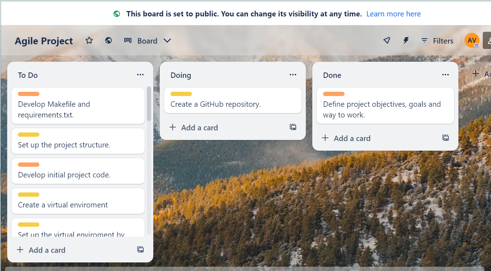
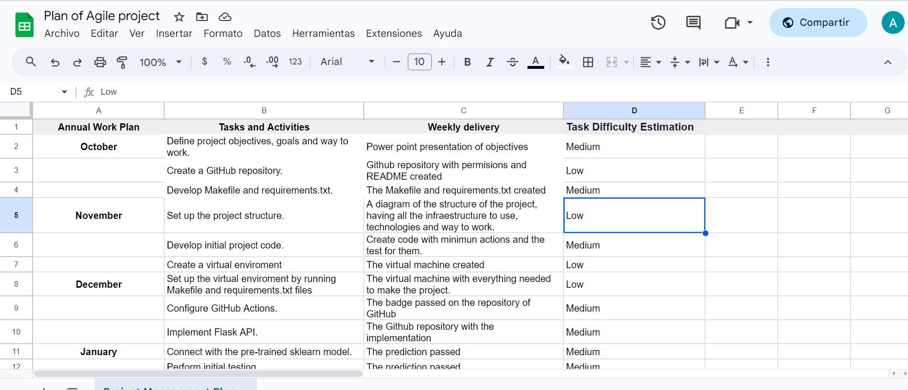

# Overview

This project involves creating a CI/CD pipeline for a Python-based machine learning application using Flask. The development starts by setting up a GitHub repository from scratch and implementing GitHub Actions. A Makefile, requirements, and application code are included to facilitate the CI/CD process. The core of the application revolves around a pre-trained scikit-learn model for predicting housing prices in Boston, with an API for making predictions.

The first phase focuses on GitHub Actions for continuous integration and delivery. This includes defining workflows in the GitHub repository and incorporating a Makefile to automate tasks. The GitHub Actions are designed to ensure the quality and functionality of the codebase as changes are made.

In the second phase, the project extends the CI/CD pipeline by integrating Azure Pipelines with the Flask web framework. The ultimate goal is to enable continuous delivery to Azure App Service, providing a seamless deployment process for the machine learning microservice.

By operationalizing the Flask app and applying CI/CD skills, the project aims to streamline the development and deployment of the machine learning application, making it efficient and reliable for predicting housing prices in a production environment.

## Project Plan

* [Link to the trello board](https://trello.com/invite/b/9kD8OOmk/ATTI5ede437729e310bb17208f2d8fb042ba8E3C1C74/agile-project)


* [Link to spreadsheet that includes the original and final project plan](https://docs.google.com/spreadsheets/d/1iSzjGNCLhfLreIUkq0XJFgNgwD52ehZjRVAmbwagZvM/edit?usp=sharing)



## Instructions

<TODO:  
* Architectural Diagram (Shows how key parts of the system work)>

<TODO:  Instructions for running the Python project.  How could a user with no context run this project without asking you for any help.  Include screenshots with explicit steps to create that work. Be sure to at least include the following screenshots:

* Project running on Azure App Service

* Project cloned into Azure Cloud Shell

* Passing tests that are displayed after running the `make all` command from the `Makefile`

* Output of a test run

* Successful deploy of the project in Azure Pipelines.  [Note the official documentation should be referred to and double checked as you setup CI/CD](https://docs.microsoft.com/en-us/azure/devops/pipelines/ecosystems/python-webapp?view=azure-devops).

* Running Azure App Service from Azure Pipelines automatic deployment

* Successful prediction from deployed flask app in Azure Cloud Shell.  [Use this file as a template for the deployed prediction](https://github.com/udacity/nd082-Azure-Cloud-DevOps-Starter-Code/blob/master/C2-AgileDevelopmentwithAzure/project/starter_files/flask-sklearn/make_predict_azure_app.sh).
The output should look similar to this:

```bash
udacity@Azure:~$ ./make_predict_azure_app.sh
Port: 443
{"prediction":[20.35373177134412]}
```

* Output of streamed log files from deployed application

> 

## Enhancements

<TODO: A short description of how to improve the project in the future>

## Demo 

<TODO: Add link Screencast on YouTube>


