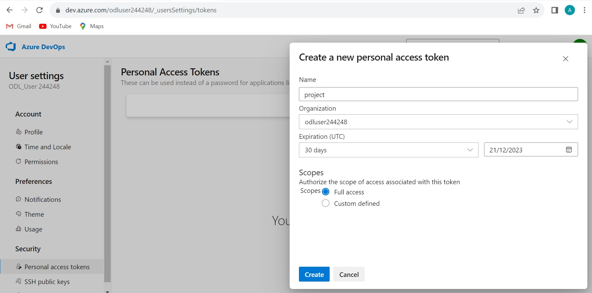
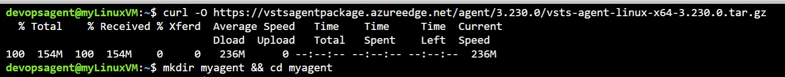

# Overview

This project involves creating a CI/CD pipeline for a Python-based machine learning application using Flask. The development starts by setting up a GitHub repository from scratch and implementing GitHub Actions. A Makefile, requirements, and application code are included to facilitate the CI/CD process. The core of the application revolves around a pre-trained scikit-learn model for predicting housing prices in Boston, with an API for making predictions.

The first phase focuses on GitHub Actions for continuous integration and delivery. This includes defining workflows in the GitHub repository and incorporating a Makefile to automate tasks. The GitHub Actions are designed to ensure the quality and functionality of the codebase as changes are made.

In the second phase, the project extends the CI/CD pipeline by integrating Azure Pipelines with the Flask web framework. The ultimate goal is to enable continuous delivery to Azure App Service, providing a seamless deployment process for the machine learning microservice.

By operationalizing the Flask app and applying CI/CD skills, the project aims to streamline the development and deployment of the machine learning application, making it efficient and reliable for predicting housing prices in a production environment.

## Project Plan

* [Link to the trello board](https://trello.com/invite/b/9kD8OOmk/ATTI5ede437729e310bb17208f2d8fb042ba8E3C1C74/agile-project)


* [Link to spreadsheet that includes the original and final project plan](https://docs.google.com/spreadsheets/d/1iSzjGNCLhfLreIUkq0XJFgNgwD52ehZjRVAmbwagZvM/edit?usp=sharing)


## Instructions

### Architectural Diagram 


### 1. Setup Azure Cloud Shell
   - Create GitHub Repository
   - Launch an Azure Cloud Shell and create the ssh keys
```bash
ssh-keygen -t rsa
cat /home/odl_user/.ssh/id_rsa.pub
```
- Upload these keys to your github account.

- Clone your repositorie in the Cloud Shell


#### 1.2 Create project scalfolding

- Create a Makefile to build and test the application. Here's an example of a makefile
```bash
install:
	pip install --upgrade pip &&\
		pip install -r requirements.txt

test:
	python -m pytest -vv test_hello.py


lint:
	pylint --disable=R,C hello.py

all: install lint test
```
- Create a requirements file with the packages needed. Here's the requirements needed,
```bash
pylint
pytest
```
- Create a file with some functions.
```bash
def toyou(x):
    return "hi %s" % x


def add(x):
    return x + 1


def subtract(x):
    return x - 1
```
- Create a file to test the functions of the previous file.
```bash
from hello import toyou, add, subtract


def setup_function(function):
    print("Running Setup: %s" % function.__name__)
    function.x = 10


def teardown_function(function):
    print("Running Teardown: %s" % function.__name__)
    del function.x


### Run to see failed test
#def test_hello_add():
#    assert add(test_hello_add.x) == 12

def test_hello_subtract():
    assert subtract(test_hello_subtract.x) == 9
```
#### 1.3 Create virtual enviroment

- Create the virtual enviroment by running
```bash
python3 -m venv ~/.myrepo
~/.myrepo/bin/activate
```
- Then run the make all command to install all needed requirements and run the local test


### 2. Configure GitHub Actions

- Go to actions in the repository and create a yml file and verify that the tests pass, copy the badge in your GitHub README


You can find all this files in [this repository](https://github.com/AnaVeaTalan/AgileProject/tree/main)

### 3. Continuos delivery with Azure

- Clone the Flask Machine Learning code on a new repository.

- You'll need to create a virtual environment and install the packages with make all.


- Create the webapp with the command 
```bash
az webapp up -n <webappname> -l westeurope --resource-group Azuredevops. 
```


- Give permissions to run the code
```bash
chmod +x make_predict_azure_app.sh 
```
- Then run the prediction with the command  
```bash
./make_predict_azure_app.sh.
```


- You can view the application logs with
```bash
az webapp log tail 
```


### 3. Load testing

- First you will need to install locust
```bash
pip install locust
```
- Create some tests using locust and run them in your local terminal 
```bash
./<filename>.sh 
```
Which will run the locust file. You have to change the file to the name of your app You can see the results in the localhost 8089.


### 4. Create an azure pipeline

- First you'll need to create an azure organization


- Then you should allow public projects in the organization settings, to then create a public project


- Next step it's to create an access token, save it for later



- You need to create a service connection you can find this in the project settings


- Then run the following command, to download an agent
```bash
curl -O https://vstsagentpackage.azureedge.net/agent/3.227.2/vsts-agent-linux-x64-3.227.2.tar.gz
```
- Create a new directory to save your new agent, you can use the following command 
```bash
mkdir myagent && cd myagent.
```

- Then extract the agent 
```bash
tar zxvf ../vsts-agent-linux-x64-3.227.2.tar.gz
```
- After extracting, your directory should look like this


- To make the agent configuration you'll just need to run the following command, fill in with your organization url and access token when asked.
```bash
./config.sh
```


- Then change your agent to online mode, with the command
```bash
./run.sh
```
- Finally create a project pipeline, you can choose a yaml starter and you should change the name of the pool to the one you created.

- That it's it, then you have a running azure pipeline


> 

## Enhancements

In the future, add Kubernetes for support in the scale of the project, this will enable to deploy and manage containers, ensuring high availability and scalability.

## Demo 

<TODO: Add link Screencast on YouTube>
